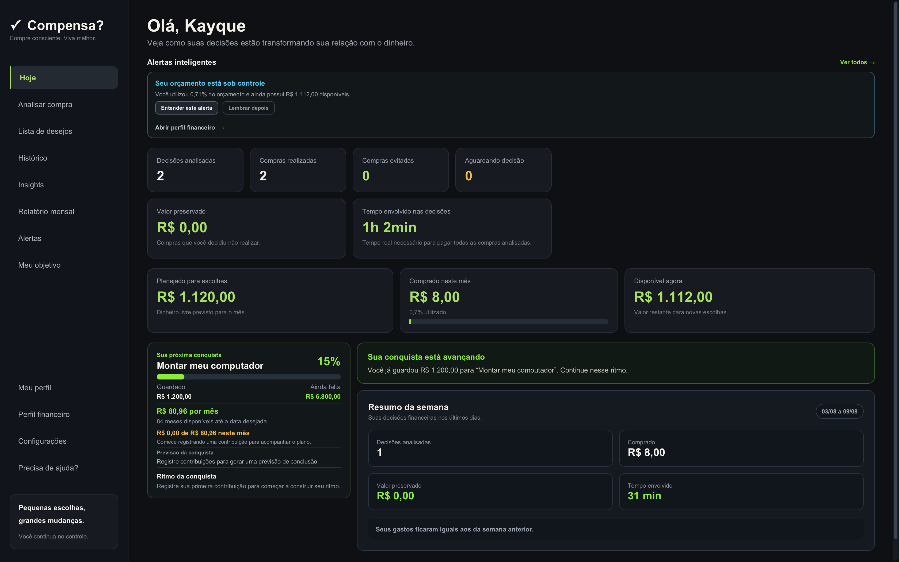
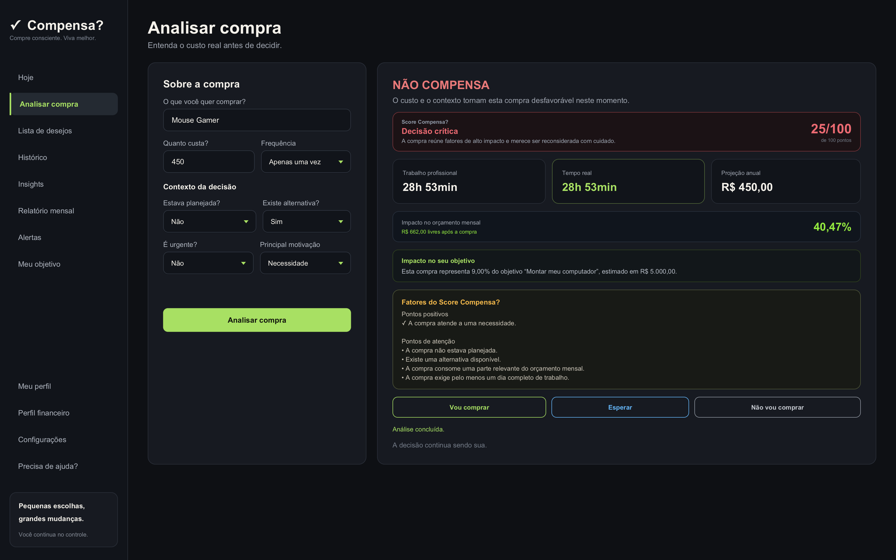
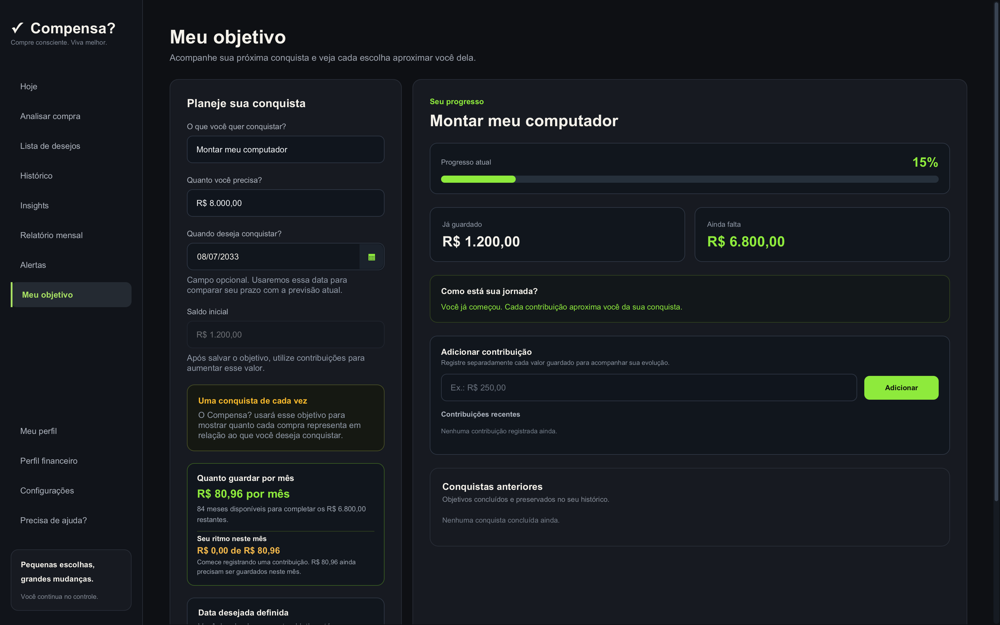
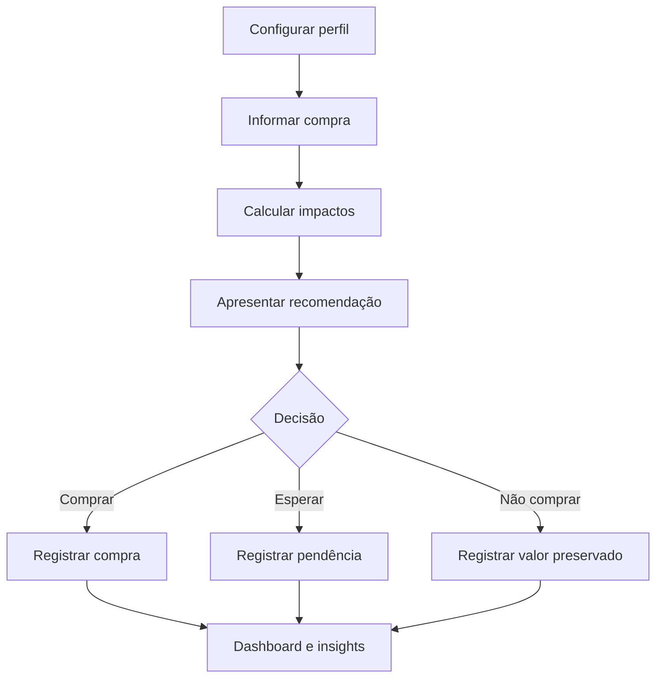

<div align="center">

# ✓ Compensa?

### Compre consciente. Viva melhor.

Aplicativo desktop que transforma o preço de uma compra em **tempo de trabalho**, **impacto no orçamento** e **distância dos seus objetivos financeiros**.

<br>


<br>

[Sobre](#-sobre-o-projeto) •
[Funcionalidades](#-principais-funcionalidades) •
[Download](#-download) •
[Tecnologias](#-tecnologias) •
[Executar](#-como-executar-localmente) •
[Privacidade](#-privacidade)

</div>

---

##  Sobre o projeto

O **Compensa?** é um aplicativo desktop de apoio à decisão financeira.

A ideia surgiu de uma pergunta simples:

> Antes de comprar, será que realmente compensa?

Normalmente, uma decisão de compra considera apenas o preço imediato. O Compensa? apresenta esse mesmo valor por outras perspectivas:

- quantas horas de trabalho são necessárias para pagar;
- quanto a compra utiliza do dinheiro livre do mês;
- qual será seu impacto caso se torne recorrente;
- quanto ela representa em relação a um objetivo financeiro;
- quais sinais de impulso, desejo, urgência ou necessidade estão presentes.

O aplicativo não decide pelo usuário e não tenta impedir compras. Seu objetivo é apresentar informações claras para que cada escolha seja feita com mais consciência.

---

##  Demonstração

<p align="center">
    
</p>

<p align="center">
    
</p>

<p align="center">
    
</p>

---

##  Principais funcionalidades

###  Análise consciente de compras

O usuário informa:

- produto;
- preço;
- frequência;
- planejamento;
- existência de alternativa;
- urgência;
- principal motivação.

Com esses dados, o Compensa? apresenta:

- tempo de trabalho profissional;
- tempo real necessário para pagar;
- projeção anual do gasto;
- impacto no orçamento mensal;
- dinheiro restante após a compra;
- impacto sobre o objetivo financeiro;
- pontuação e motivos da análise;
- recomendação personalizada.

---

###  Recomendações transparentes

As recomendações são produzidas por regras locais e compreensíveis.

A análise considera fatores como:

- compra planejada ou não planejada;
- necessidade, desejo ou impulso;
- existência de alternativa;
- urgência;
- tempo de trabalho necessário;
- impacto sobre o dinheiro livre;
- situação atual do orçamento.

O usuário também pode escolher o tom das mensagens:

- gentil;
- equilibrado;
- direto e objetivo.

A decisão final permanece sempre com o usuário.

---

###  Perfil financeiro

O perfil financeiro permite cadastrar:

- renda mensal líquida;
- horas trabalhadas por mês;
- horas adicionais comprometidas;
- despesas essenciais;
- meta mensal de economia.

Com essas informações, o aplicativo calcula:

- valor da hora profissional;
- valor da hora real;
- dinheiro livre do mês;
- orçamento disponível para escolhas.

```text
Renda líquida
- Despesas essenciais
- Meta de economia
= Dinheiro livre para escolhas
```

---

###  Preço convertido em tempo

O Compensa? apresenta duas interpretações do tempo necessário para pagar uma compra.

**Trabalho profissional:** considera apenas a jornada oficial.

**Tempo real:** também considera horas adicionais comprometidas, como deslocamento e preparação.

Isso aproxima o cálculo da realidade de cada usuário.

---

###  Controle do orçamento mensal

Cada compra é comparada ao dinheiro livre disponível.

O aplicativo acompanha:

- total comprado no mês;
- porcentagem utilizada;
- dinheiro disponível;
- valor restante após uma compra;
- orçamento no limite;
- orçamento insuficiente;
- orçamento em déficit.

As compras confirmadas são acumuladas automaticamente durante o mês.

---

###  Objetivo financeiro

O usuário pode criar uma conquista informando:

- nome do objetivo;
- valor necessário;
- saldo inicial já guardado.

A tela apresenta:

- porcentagem concluída;
- barra de progresso;
- valor guardado;
- valor restante;
- situação atual da jornada;
- previsão aproximada de conclusão.

Cada compra analisada também pode ser comparada ao objetivo, mostrando quanto ela representa em relação à conquista desejada.

---

###  Contribuições e progresso

Valores guardados podem ser registrados individualmente.

Cada contribuição possui:

- valor;
- data e horário;
- atualização automática do saldo;
- atualização automática do progresso;
- opção para desfazer o lançamento.

O aplicativo reconhece marcos de:

- 25%;
- 50%;
- 75%;
- 100%.

Os marcos alcançados são persistidos para que a mesma conquista não seja celebrada repetidamente.

---

###  Histórico de conquistas

Objetivos concluídos são preservados no histórico.

Isso permite acompanhar conquistas anteriores sem perder o progresso construído ao criar uma nova meta.

---

### Dashboard personalizado

A tela inicial reúne os principais dados:

- saudação personalizada;
- decisões analisadas;
- compras realizadas;
- compras evitadas;
- decisões aguardando resposta;
- valor preservado;
- tempo envolvido nas decisões;
- orçamento planejado;
- valor comprado no mês;
- dinheiro disponível;
- progresso do objetivo;
- alertas importantes.

---

### Histórico e avaliação pós-compra

Cada decisão pode ser registrada como:

- comprei;
- vou esperar;
- não vou comprar.

Compras realizadas podem ser avaliadas posteriormente como:

- valeu a pena;
- valeu parcialmente;
- me arrependi.

Essas informações alimentam o histórico e os insights do aplicativo.

---

###  Insights financeiros

O Compensa? identifica padrões a partir das decisões registradas:

- taxa de compras realizadas;
- taxa de compras evitadas;
- decisões pendentes;
- tempo médio por decisão;
- satisfação;
- arrependimento;
- padrões de comportamento.

Quando ainda existem poucos dados, o aplicativo evita conclusões precipitadas.

---

###  Personalização

O perfil do usuário permite configurar:

- nome de exibição;
- principal objetivo;
- tom das recomendações;
- conquista financeira atual.

Essas informações tornam as mensagens mais relevantes sem exigir uma conta on-line.

---

###  Central de ajuda

A central de ajuda explica:

- funcionamento da análise;
- cálculo do tempo;
- pontuação;
- impacto no orçamento;
- objetivos;
- contribuições;
- histórico;
- insights;
- armazenamento dos dados.

---

###  Splash screen

A inicialização possui uma animação personalizada com:

- identidade visual;
- transição do logotipo;
- indicador de progresso;
- identificação do desenvolvedor.

---

##  Fluxo principal



---

##  Arquitetura

O projeto utiliza organização por domínio e separação de responsabilidades.

```text
src/main/java/com/kayque/compensa
├── dashboard
├── database
├── goal
├── history
├── insights
├── profile
├── purchase
├── settings
├── splash
├── userprofile
└── wishlist
```

Cada domínio pode ser dividido em:

| Camada | Responsabilidade |
|---|---|
| `controller` | Eventos da interface JavaFX |
| `model` | Entidades e regras fundamentais |
| `service` | Cálculos e regras de negócio |
| `repository` | Persistência e consultas SQLite |

Essa estrutura reduz o acoplamento entre interface, regras de negócio e banco de dados.

---

## ️ Persistência

O Compensa? utiliza SQLite e cria o banco automaticamente na primeira execução.

Os principais dados armazenados são:

- perfil financeiro;
- preferências do usuário;
- decisões de compra;
- avaliações;
- lista de desejos;
- objetivo financeiro;
- contribuições;
- marcos;
- conquistas concluídas.

O inicializador do banco executa migrações locais para preservar os dados entre atualizações.

### macOS e Linux

```text
~/.compensa/compensa.db
```

### Windows

```text
C:\Users\SEU_USUARIO\.compensa\compensa.db
```

---

##  Privacidade

O Compensa? foi desenvolvido com uma abordagem **local-first**.

Na versão `1.0.0`:

- não existe criação de conta;
- não existe servidor externo;
- não existe sincronização em nuvem;
- não existe rastreamento;
- nenhum dado financeiro é enviado pela internet;
- não existe integração com bancos;
- todas as informações permanecem no dispositivo.

> O Compensa? é uma ferramenta de apoio à reflexão e não substitui orientação financeira profissional.

---

##  Tecnologias

| Tecnologia | Utilização |
|---|---|
| Java 21 | Linguagem principal |
| JavaFX 21.0.6 | Interface desktop |
| FXML | Estrutura das telas |
| CSS | Identidade visual |
| SQLite | Banco local |
| SQLite JDBC 3.53.2.0 | Integração com o banco |
| Maven | Dependências e build |
| JUnit 5.12.1 | Testes automatizados |
| Surefire 3.5.2 | Execução dos testes |
| JPMS | Modularização |
| GitHub Actions | Build automatizado para Windows |
| Qodana | Análise de qualidade |
| jlink | Runtime Java personalizado |
| jpackage | Distribuição desktop |

---

##  Download

A versão atual é a **1.0.0**.

Os arquivos para Windows e macOS estão disponíveis na página de Releases:

### [ Baixar o Compensa?](https://github.com/kayquemigueldev/compensa/releases)

---

### Windows

1. Baixe a versão para Windows.
2. Extraia o arquivo, caso necessário.
3. Execute o Compensa?.
4. Preencha seu perfil financeiro.

Como a versão ainda pode não possuir uma assinatura digital comercial, o Windows SmartScreen poderá exibir um aviso.

Nesse caso:

1. clique em **Mais informações**;
2. confirme que o arquivo veio deste repositório;
3. clique em **Executar assim mesmo**.

O pacote inclui o runtime necessário. Não é preciso instalar Java manualmente.

---

### macOS

Arquivo:

```text
Compensa-1.0.0.dmg
```

1. Baixe o arquivo.
2. Abra a imagem de disco.
3. Arraste o aplicativo para **Aplicativos**.
4. Abra o Compensa?.

Caso o macOS bloqueie a primeira execução:

1. abra **Ajustes do Sistema**;
2. acesse **Privacidade e Segurança**;
3. localize o aviso do Compensa?;
4. clique em **Abrir Mesmo Assim**.

---

##  Como executar localmente

### Pré-requisitos

- JDK 21;
- Git.

O Maven Wrapper já está incluído.

### Clonar

```bash
git clone https://github.com/kayquemigueldev/compensa.git
cd compensa
```

### Executar os testes

macOS ou Linux:

```bash
./mvnw clean test
```

Windows:

```powershell
.\mvnw.cmd clean test
```

### Executar o aplicativo

macOS ou Linux:

```bash
./mvnw javafx:run
```

Windows:

```powershell
.\mvnw.cmd javafx:run
```

### Compilar

```bash
./mvnw clean package
```

### Gerar runtime personalizado

```bash
./mvnw clean javafx:jlink
```

---

##  Testes

A suíte automatizada cobre regras como:

- cálculo do valor do trabalho;
- orçamento mensal;
- impacto financeiro;
- recomendações;
- mensagens personalizadas;
- perfil do usuário;
- progresso do objetivo;
- contribuições;
- previsão de conclusão;
- marcos;
- alertas;
- insights;
- validações monetárias.

```bash
./mvnw clean test
```

Resultado esperado:

```text
Failures: 0
Errors: 0
BUILD SUCCESS
```

---

##  Integração contínua

O projeto possui automação para gerar a versão Windows:

```text
.github/workflows/build-windows.yml
```

O workflow:

- configura o Java 21;
- compila o projeto;
- executa os testes;
- prepara o runtime;
- gera a distribuição para Windows;
- disponibiliza o resultado como artefato.

---

##  Status da versão 1.0.0

- [x] Análise de compras
- [x] Recomendações personalizadas
- [x] Perfil financeiro
- [x] Impacto no orçamento
- [x] Histórico de decisões
- [x] Avaliação pós-compra
- [x] Lista de desejos
- [x] Dashboard
- [x] Insights
- [x] Perfil do usuário
- [x] Objetivo financeiro
- [x] Contribuições
- [x] Marcos de progresso
- [x] Previsão de conclusão
- [x] Histórico de conquistas
- [x] Alertas
- [x] Central de ajuda
- [x] Splash screen
- [x] Persistência SQLite
- [x] Migrações automáticas
- [x] Testes automatizados
- [x] Distribuição para macOS
- [x] Build para Windows

---

##  Próximas possibilidades

- [ ] exportação de relatórios;
- [ ] backup e restauração;
- [ ] mais de um objetivo simultâneo;
- [ ] gráficos históricos;
- [ ] versão mobile;
- [ ] sincronização opcional entre dispositivos.

> Essas ideias representam possibilidades futuras e não fazem parte da versão atual.

---

##  Relatar um problema

Problemas e sugestões podem ser enviados pela aba Issues:

### [Abrir uma issue](https://github.com/kayquemigueldev/compensa/issues)

Inclua:

- sistema operacional;
- versão utilizada;
- comportamento esperado;
- comportamento encontrado;
- passos para reproduzir;
- captura de tela, quando possível.

> Não publique o arquivo `compensa.db`, pois ele pode conter informações pessoais.

---

##  Desenvolvedor

<div align="center">

### Desenvolvido por Kayque Miguel

Estudante de Sistemas de Informação e desenvolvedor focado em Java, aplicações desktop e desenvolvimento web.

[](https://github.com/kayquemigueldev)

</div>

---

## ️ Aviso

O Compensa?:

- não oferece consultoria financeira;
- não recomenda investimentos;
- não acessa contas bancárias;
- não movimenta dinheiro;
- não garante economia;
- não substitui orientação profissional.

As decisões continuam sendo responsabilidade do usuário.

---

##  Direitos autorais

Copyright © 2026 Kayque Miguel.

Todos os direitos reservados.

Este projeto foi desenvolvido para fins educacionais, de portfólio e uso pessoal. A redistribuição, modificação ou utilização comercial do código não é permitida sem autorização do autor.

---

<div align="center">

## ✓ Compensa?

**Pequenas escolhas, grandes mudanças.**

Você continua no controle.

<br>

Desenvolvido com Java por **Kayque Miguel**.

</div>
